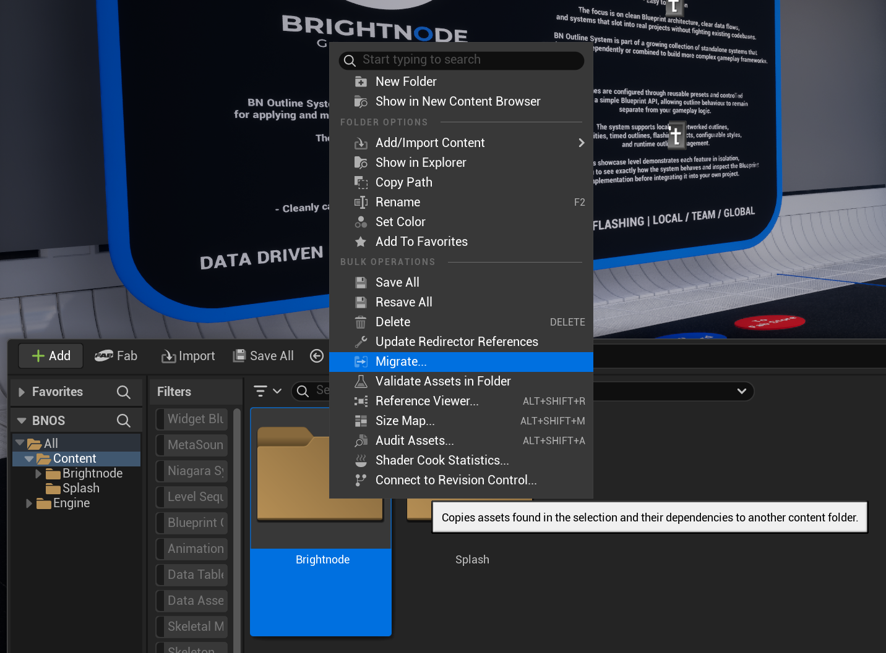

# Installation & Setup

The Brightnode Outline System is supplied as an Unreal Engine project containing the complete system and a showcase level.

## Before You Start

Open the included showcase level first. It demonstrates the major features and provides working Blueprint examples that can be inspected alongside this documentation.

## Core Assets

The system is built around:

* **Outline Component**, the main player-facing API
* **Outline World Manager**, manages shared Team and Global outline state
* **Outline Preset Library**, registers the presets available to the system
* **Outline Preset Data Assets**, define individual outline behaviours

## Project Setup

Migrate the Brightnode folder into your project content folder. If you already have a Brightnode product it will ask if you want to overwrite some folders, select apply to all and hit no.

<figure><figcaption></figcaption></figure>

<figure><figcaption></figcaption></figure>

After Migration:

1. In Project Settings set Custom Depth-Stencil Pass to Enabled with Stencil.
2. Add the Outline Component to the player that will display outlines.
3. Ensure the World Manager is present using the supplied implementation.
4. Assign an Outline Preset Library to the World Manager.
5. Create the Gameplay Tags required by your presets.
6. Create and register your Outline Presets.
7. Test a Local outline before moving on to Team or Global behaviour.

See **Quick Start** for the complete first-outline workflow.
